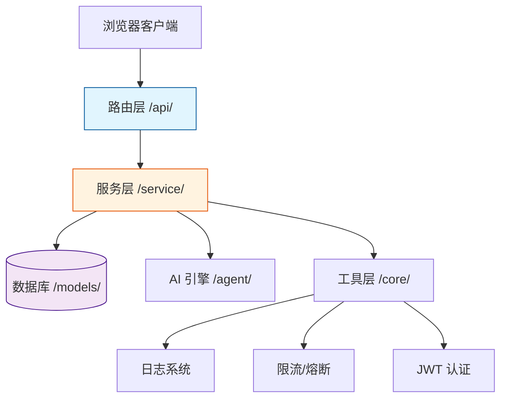

# TestPilot 智能自动化测试平台

[](https://github.com/LKlwx/TestPilot/actions/workflows/ci.yml)

## 项目介绍
TestPilot 是基于 Python Flask 自主开发的**一站式轻量级自动化测试平台**，采用前后端不分离架构，按照路由层、服务层、模型层、工具层进行工程化分层设计。平台实现了**用户权限管理、接口自动化测试、UI 自动化测试、性能压测、AI 智能测试辅助**五大核心能力，支持用例管理、自动化执行、测试报告生成、数据可视化看板等完整基础流程，是面向测试开发工程师岗位的实战型个人项目。



## 项目亮点
- 完善的基础权限体系：支持用户登录、注册、超级管理员/管理员/普通用户三级权限控制
- 标准化后端结构：统一响应封装、全局异常处理、代码模块化解耦
- 核心测试能力全覆盖：集成接口、UI、性能三大常用自动化测试模块
- AI 辅助测试：基于本地大模型（LM Studio）实现用例自动生成与失败日志智能诊断
- 可视化数据看板：展示用例分布、缺陷发现趋势、慢接口分析等关键数据
- 服务稳定性保障：全局限流（防刷）+ 熔断降级（防雪崩），只统计 5xx 触发熔断避免误杀
- **生产环境安全加固**：启动时密钥强校验，拒绝弱密钥上线；JWT鉴权全覆盖（7个关键接口已补齐）；全局异常信息脱敏（生产环境不暴露堆栈）；用户注册多层防护（防admin绕过、防特殊字符注入）
- 多环境隔离：开发/测试/演示/生产四环境独立数据库，通过环境变量一键切换
- 全部功能基于本地环境运行，无第三方云服务依赖，轻量易部署

## 技术栈
- 后端：Python 3.14 + Flask
- 数据库：SQLite
- ORM：Flask-SQLAlchemy
- 身份认证：Flask-JWT-Extended（双Token无感刷新）、Flask-Login
- 参数校验：marshmallow 4.x（Schema 声明式校验）
- 前端：HTML + CSS + JavaScript + ECharts
- 接口自动化：Requests
- UI 自动化：Selenium（无头模式）
- 性能测试：Python 线程池并发
- AI 模块：本地大模型集成（LM Studio + Qwen3.5 9B）
- 其他：系统操作日志、统一响应封装、全局异常捕获、分级日志体系（DEBUG/INFO/ERROR）

## 项目结构
```
TestPilot/
├── run.py                 # 项目启动入口
├── app.py                # Flask 应用初始化与蓝图注册
├── config.py             # 项目基础配置
├── models/             # 数据库表结构模型（包结构）
│   ├── __init__.py     # 模型导入入口（原 models.py）
│   └── base_case.py    # 用例基础抽象类 BaseCaseMixin
├── extensions.py       # db、jwt 等扩展实例化
├── requirements.txt     # 依赖包列表
├── Dockerfile         # Docker 镜像配置
├── docker-compose.yml  # Docker Compose 配置
├── .gitignore        # Git 忽略文件配置
├── .gitflow           # GitFlow 分支管理配置
├── .github/
│   └── workflows/
│       └── ci.yml    # GitHub Actions CI/CD 配置
├── docs/              # 项目文档
│   └── GITFLOW.md   # Git分支管理规范
├── tests/             # 单元测试目录
│   ├── __init__.py
│   └── test_core.py
├── api/              # 接口路由层
│   ├── schemas.py    # API 请求参数校验 Schema（marshmallow）
│   ├── auth.py       # 用户、权限、控制台接口
│   ├── test.py      # 接口测试接口
│   ├── ui.py        # UI 测试接口
│   ├── performance.py  # 性能测试接口
│   └── ai.py        # AI 辅助测试接口
├── service/          # 业务逻辑层
│   ├── operation_log_service.py  # 操作日志服务
│   ├── user_service.py
│   ├── test_service.py
│   ├── ui_service.py
│   ├── performance_service.py
│   └── ai_service.py
├── agent/            # AI 核心引擎
│   └── ai_agent_core.py
├── core/             # 公共工具层
│   ├── response.py   # 统一响应封装
│   ├── exception.py  # 全局异常处理
│   ├── schema.py     # marshmallow 统一校验入口
│   ├── logger.py    # 日志配置
│   ├── logs/        # 日志文件目录（运行时自动生成）
│   ├── ratelimit.py # 限流与熔断防护逻辑
│   ├── middleware.py
│   └── execution_context.py  # 执行上下文（变量替换、日志记录）
├── scripts/          # 数据迁移与运维脚本
│   └── migrate_task_cases.py  # TestTask 关联表数据迁移
├── instance/         # SQLite 数据库目录（运行时自动生成）
├── static/           # 静态资源
└── templates/       # HTML 页面模板
```

## 数据模型说明
项目共设计 11 张核心数据表，全部持久化存储：
1. **User**：用户信息、角色、密码
2. **TestCase**：接口测试用例
3. **TestReport**：接口测试报告
4. **UICase**：UI 自动化用例
5. **UIReport**：UI 测试报告
6. **PerformanceCase**：性能测试用例
7. **PerformanceReport**：性能测试指标报告
8. **TestTask**：定时任务配置
9. **AIAgentTask**：AI 操作记录（已落库，支持历史查看）
10. **SysOperationLog**：系统操作日志（已落库，支持审计页面查看）
11. **PerformanceDetail**：压测明细数据（存储每次请求耗时，用于慢接口分析）

## 本地运行方式
1. 进入项目根目录
2. 安装依赖
   ```bash
   pip install -r requirements.txt
   ```
3. 配置环境变量（推荐使用 `.env` 文件，建议第一步就做）
   ```bash
   # 复制模板文件
   cp .env.example .env
   
   # 编辑 .env 文件，填入随机生成的密钥
   # SECRET_KEY 和 JWT_SECRET_KEY 生产环境必填，长度 >= 32 字符
   # 可使用 openssl rand -base64 32 一键生成
   ```
4. 启动项目（默认开发环境）
   ```bash
   python run.py
   ```
5. 切换环境启动
   ```bash
   # 开发环境（默认）- 未配置密钥时会打印 WARNING 但允许启动
   python run.py
   
   # 测试环境（独立数据库）
   FLASK_ENV=test python run.py
   
   # 演示环境（独立数据库）- 必须配置强密钥，否则拒绝启动
   FLASK_ENV=demo python run.py
   
   # 生产环境 - 必须配置强密钥，否则拒绝启动
   FLASK_ENV=production python run.py
   ```
   > **注意**：密钥配置通过 `.env` 文件后，启动命令无需再传入 `SECRET_KEY=xxx`。`FLASK_ENV` 也可以通过 `.env` 文件设置，或通过命令动态覆盖。
6. 访问地址
   ```
   http://127.0.0.1:5000
   ```

## Docker 容器化部署
1. 确保已安装 Docker Desktop
2. **配置密钥环境变量**（生产环境必需）：
   ```bash
   # 方法1：复制 .env.example 为 .env 并填写
   cp .env.example .env
   # 编辑 .env 文件，填入随机生成的密钥
   
   # 方法2：直接生成随机密钥
   export SECRET_KEY=$(openssl rand -base64 32)
   export JWT_SECRET_KEY=$(openssl rand -base64 32)
   ```
3. 执行构建命令：
   ```bash
   docker-compose up -d --build
   ```
4. 访问地址：
   ```
   http://localhost:5000
   ```

**架构优势**：
- 零环境配置：无需安装 Python、Flask 或配置虚拟环境
- 环境一致性：开发、测试、生产环境完全一致，避免"我本地能跑"问题
- 数据持久化：通过 Volume 挂载实现数据库文件持久存储，容器重启数据不丢失
- **安全强制**：生产环境未配置强密钥将拒绝启动，防止带病上线

## GitHub Actions CI/CD
1. 推送代码到 GitHub 仓库
2. 每次 push 自动触发 CI 流程：
   - 自动安装项目依赖
   - 自动运行单元测试
   - 自动生成测试覆盖率报告
3. 查看 Actions 运行结果：
   ```
   https://github.com/LKlwx/TestPilot/actions
   ```

**CI/CD 优势**：
- 代码提交自动验证，确保主分支代码可运行
- 及时发现代码问题，减少集成风险
- 测试覆盖率可视化，提升代码质量感知

## 默认账号
- 用户名：admin
- 密码：123456
- 补充说明：项目首次启动时会自动检测并创建超级管理员账号

## 功能展示
### 主界面


### 接口自动化测试


### UI 自动化测试


### 性能压测


### 系统管理


## 功能模块说明
### 1. 用户权限与登录模块
- 实现用户登录、注册、JWT 身份认证（双Token无感刷新）
- 支持超级管理员/管理员/普通用户三级权限控制
- 注册安全加固：`strip().lower()` 清理 + 正则合法字符限制，防止 `" admin"`、`"Admin"` 等变体绕过
- 登录查询大小写不敏感，确保用户名一致性
- 已实现完整的用户列表、角色管理及操作日志审计功能
- 关键操作（登录、删除、修改）自动写入系统日志

### 2. 控制台数据看板
- 展示用例总数、接口/UI/性能用例分布（ECharts 环形图）
- 统计今日接口/UI 执行活跃度
- 展示近 7 天缺陷发现趋势图（面积图 + 异常点标记）
- 展示最近一次压测的 Top 5 慢接口分析（双轴混合图）

### 3. 接口自动化测试模块
- 支持用例新增、删除、列表查询
- 支持配置请求方法、请求头、JSON 请求体、预期关键字
- 支持单条用例执行与批量执行
- 自动生成测试报告，支持报告列表与详情查看
- **✨ 进阶能力**：
  - 接口链路测试：创新性地实现了基于内存变量池的上下文传递机制，支持通过自定义路径表达式提取响应数据并动态注入后续请求，解决了登录 Token 传递等经典痛点。
  - 高并发回归：引入 ThreadPoolExecutor 线程池模型，将批量用例执行模式从串行升级为并行，在保证 SQLite 数据一致性的前提下，显著缩短了大规模回归测试的耗时。
  - 工程化规范：遵循 RESTful 风格设计 API，实现了统一的全局异常捕获与标准化响应封装，提升了前后端交互的稳定性。
### 4. UI 自动化测试模块
- 支持 UI 用例新增、删除、列表查询
- 支持配置测试 URL、操作步骤、元素定位信息
- **✨ 进阶能力**：
  - 结构化步骤引擎：自主设计 `[action] [locator] value` 文本协议，支持 ID、XPath、CSS 等多种定位方式，实现了自然语言到 Selenium 指令的自动转换。
  - 稳定性增强：引入显式等待（Explicit Wait）机制替代硬编码休眠，并实现**失败自动截图**功能，显著提升了无头模式下的执行成功率与问题排查效率。
  - 复杂交互模拟：支持键盘模拟（如回车键）、页面文本断言及标题验证，覆盖了搜索、登录等核心业务场景。
- 基于 Selenium 无头浏览器执行自动化操作，自动生成并保存可视化测试报告
- 自动解析并执行输入、点击等文本步骤
- 自动生成并保存 UI 测试报告，支持列表与详情查看

### 5. 性能测试模块
- 支持性能用例新增、删除、列表查询
- 支持自定义并发数、总请求数、请求配置
- 基于线程池实现多线程并发压测
- 自动统计 QPS、响应时间、成功率等指标
- 生成性能测试报告并支持查看
- **✨ 更新内容**：
  - **性能压测引擎升级**：引入 `numpy` 实现 **P90/P99 长尾延迟计算**与**成功率统计**，突破单一 QPS 指标局限，更精准定位性能瓶颈。
  - **智能传参适配**：根据 Headers 中 `Content-Type` 自动判断使用 `json=` 还是 `data=`，修复 JSON 接口传参错误；非法 JSON 自动回退到 `data=` 模式并记录日志。
  - **多维可视化报告**：压测详情页完整展示 QPS、平均耗时、P90/P99 及成功率，辅助优化决策。
  - **全功能交互完善**：性能模块新增**用例在线编辑**功能，实现与接口/UI 模块体验统一；修复报告详情渲染与样式异常，提升系统稳定性。
  - **压测明细追踪**：新增 PerformanceDetail 表，自动记录每次请求的耗时与状态码，支持首页 Top 5 慢接口动态分析。

### 6. 日志与监控体系
- **分级日志系统**：使用 Python `logging` 模块，按 DEBUG/INFO/ERROR 三级分离
  - `app.log`：日常运行日志（保留 7 个文件，单文件 10MB）
  - `error.log`：错误日志（保留 30 个文件，带完整堆栈）
  - `debug.log`：开发环境专用（DEBUG 级别）
- **Service 层日志规范化**：核心 Service（test_service.py 等）全部使用 `logger.info()/error()` 替代 `print()`，支持模块级日志名（`__name__`），方便定位问题来源
- **全局异常与日志联动**：生产环境异常不暴露堆栈，仅返回"服务器内部错误"，同时完整堆栈写入 `error.log`，兼顾安全与排错

### 7. AI 智能测试模块
- 基于本地大模型（LM Studio）实现 AI 能力，无云端依赖
- 根据业务场景自动生成接口测试用例（包含请求方法、路径、头、体、断言）
- 根据业务场景自动生成 UI 测试用例（包含 URL 与操作步骤）
- 自动分析测试失败日志并给出原因与解决方案
- 支持将 AI 生成的用例一键保存至用例库
- AI 操作记录持久化存储，支持历史记录查询与回溯
- **✨ 进阶能力**：
  - 通过 `requests` 调用 LM Studio OpenAI 兼容接口，实现本地模型推理
  - 健壮的 JSON 解析机制：支持 Markdown 代码块提取、中文键自动映射、容错降级
  - 配置集中管理：模型地址与名称统一在 `config.py` 中维护，方便后续切换模型
