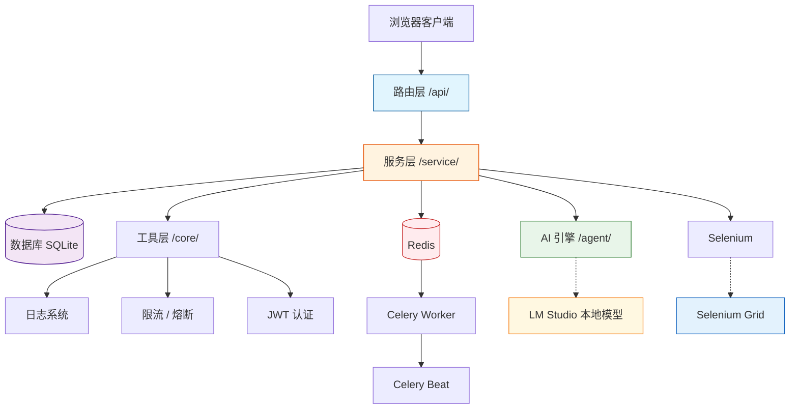
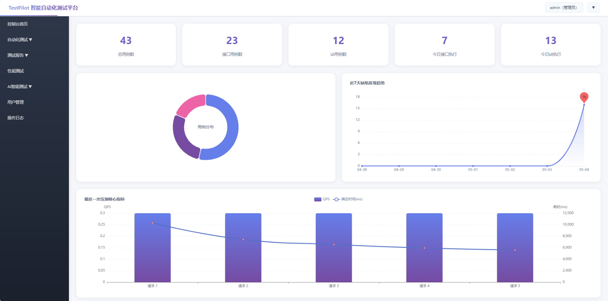
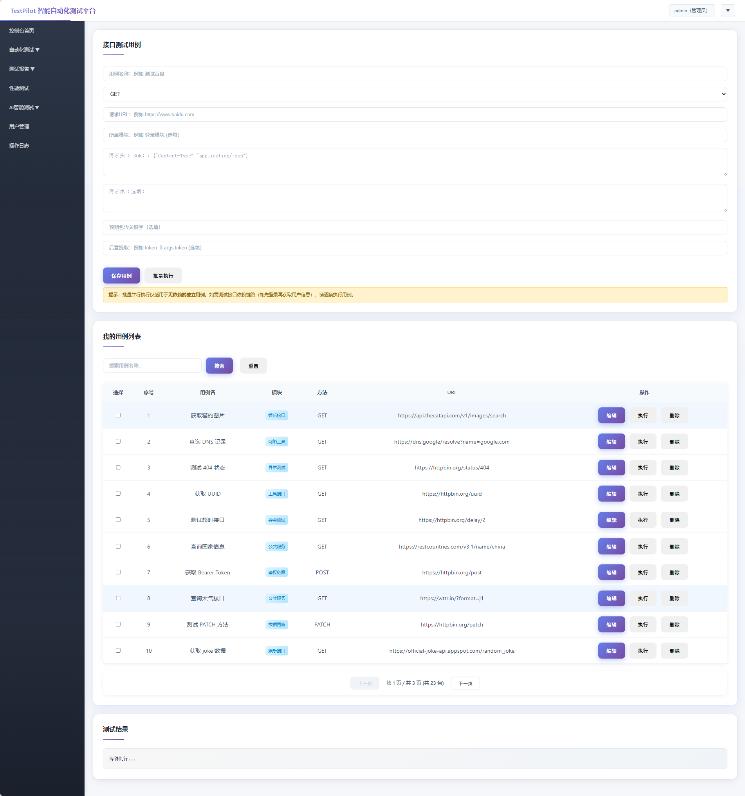
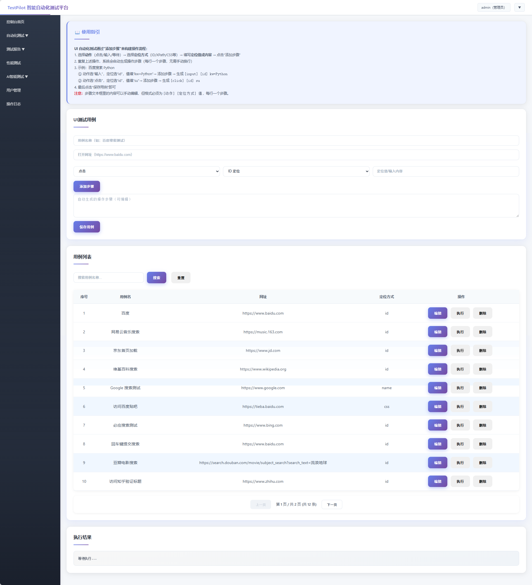
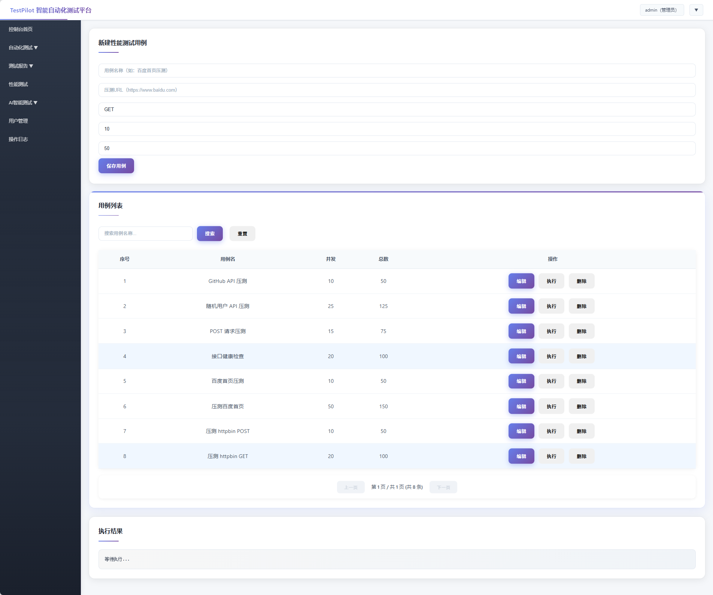
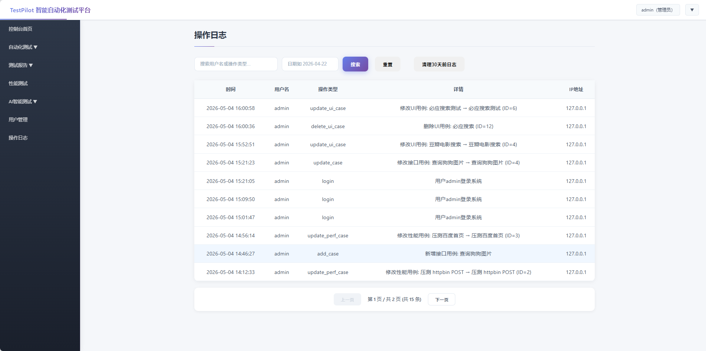

# TestPilot 智能自动化测试平台

[](https://github.com/LKlwx/TestPilot/actions/workflows/ci.yml)

## 目录

- [项目介绍](#项目介绍)
- [项目亮点](#项目亮点)
- [技术栈](#技术栈)
- [系统要求](#系统要求)
- [项目结构](#项目结构)
- [数据模型说明](#数据模型说明)
- [环境变量参考](#环境变量参考)
- [本地运行方式](#本地运行方式)
- [Docker 容器化部署](#docker-容器化部署)
- [GitHub Actions CI/CD](#github-actions-cicd)
- [默认账号](#默认账号)
- [功能展示](#功能展示)
- [功能模块说明](#功能模块说明)
- [常见问题](#常见问题)

## 项目介绍
TestPilot 是基于 Python Flask 自主开发的**一站式轻量级自动化测试平台**，采用前后端不分离架构，按照路由层、服务层、模型层、工具层进行工程化分层设计。平台实现了**用户权限管理、接口自动化测试、UI 自动化测试、性能压测、AI 智能测试辅助**五大核心能力，支持用例管理、自动化执行、测试报告生成、数据可视化看板等完整基础流程，是面向测试开发工程师岗位的实战型个人项目。



## 项目亮点

#### 安全与稳定性
- 完善的基础权限体系：支持用户登录、注册、超级管理员/管理员/普通用户三级权限控制
- **生产环境安全加固**：启动时密钥强校验，拒绝弱密钥上线；JWT 鉴权全覆盖 + 登出黑名单机制；全局异常信息脱敏（生产环境不暴露堆栈）；用户注册多层防护（防admin绕过、防特殊字符注入）；密码强度强制（8位+字母+数字）；登录防暴力破解（5次失败锁定15分钟）
- 服务稳定性保障：三层限流（全局限流兜底 + IP 级 + 用户级，基于 Redis 滑动窗口多 Worker 共享）+ 熔断降级（防雪崩），只统计 5xx 触发熔断避免误杀
- **CI 安全左移**：GitHub Actions 集成 SAST（bandit 源码扫描）+ SCA（pip-audit 依赖漏洞扫描），每次 push 发现硬编码密钥或 CVE 自动阻断合并
- 多环境隔离：开发/测试/演示/生产四环境独立数据库，通过环境变量一键切换

#### 测试能力
- 核心测试能力全覆盖：集成接口、UI、性能三大常用自动化测试模块
- **失败自动重试与 Flaky 处理**：按用例级配置重试次数，重试后通过标记为 FLAKY（黄色警告），始终失败标记为 FAIL（红色失败），近 5 次执行 ≥ 3 次 FLAKY 自动标记为不稳定用例
- **数据驱动测试**：TestDataSet 模型绑定多组数据行，引擎自动将 {{变量}} 注入用例模板循环执行，支持 CSV/JSON 文件导入
- **接口契约测试**：Swagger 导入自动提取 JSON Schema，执行时 `jsonschema.validate()` 自动校验响应与契约一致性，字段类型/必填/枚举不符自动报警
- **Selenium Grid 分布式 UI 测试**：支持本地/Remote 双驱动模式，用例级配置 Chrome/Firefox/Edge 多浏览器，执行前自动检查 Grid 节点健康度
- **分布式并行执行**：自研 Celery chord + group 任务分发器，50 个用例切 4 份并行执行，总耗时接近 1/N，结果自动合并

#### 工程化与效率
- 标准化后端结构：统一响应封装、全局异常处理、代码模块化解耦
- 可视化数据看板：展示用例分布、缺陷发现趋势、慢接口分析等关键数据
- **用例导入导出**：支持 Postman Collection v2.1 导入、Swagger 一键生成接口用例、JSON/CSV 多格式导出，实现测试资产迁移与离线归档
- AI 辅助测试：基于本地大模型（LM Studio）实现用例自动生成与失败日志智能诊断，支持异步提交不阻塞 HTTP
- 全部功能基于本地环境运行，无第三方云服务依赖，轻量易部署

## 技术栈
- 后端：Python 3.14 + Flask
- 数据库：SQLite
- ORM：Flask-SQLAlchemy + Flask-Migrate（数据库迁移）
- 身份认证：Flask-JWT-Extended（双Token无感刷新）
- 异步任务：Celery + Redis（异步任务队列）
- 参数校验：marshmallow 4.x（Schema 声明式校验）
- 前端：HTML + CSS + JavaScript + ECharts
- 接口自动化：Requests
- UI 自动化：Selenium（无头模式）
- 性能测试：asyncio + aiohttp 协程引擎
- AI 模块：本地大模型集成（LM Studio + Qwen3.5 9B）
- 测试报告：allure-pytest（Allure 可视化测试报告，含步骤追踪、截图附件、历史趋势）
- 并行测试：pytest-xdist（多 CPU 核心并行执行单元测试，pytest.ini 配置 -n auto）
- 数据工厂：Faker + 随机数据生成 + Setup/Teardown 上下文管理器
- 其他：系统操作日志、统一响应封装、全局异常捕获、分级日志体系（DEBUG/INFO/ERROR）、Redis 缓存加速（Dashboard 60s 缓存）

## 系统要求

| 组件 | 要求 | 说明 |
|------|------|------|
| Python | 3.14 | 运行 Flask 应用与 Celery Worker |
| Redis | 7.x（可选） | 异步任务队列、JWT 黑名单、限流、缓存。不安装则对应功能自动降级 |
| 浏览器 | Chrome / Firefox / Edge | UI 自动化测试依赖，`webdriver-manager` 自动管理驱动版本 |
| LM Studio | 本地服务（可选） | AI 模块依赖本地大模型推理，需启动服务并加载模型 |
| Allure CLI | 2.x（可选） | `allure serve allure-results` 查看可视化报告，不安装不影响测试执行 |
| 磁盘空间 | ~100MB | 项目文件 + SQLite 数据库 + Python 依赖包 |

## 项目结构
```
TestPilot/
├── run.py                 # 项目启动入口
├── app.py                # Flask 应用初始化与蓝图注册
├── config.py             # 项目基础配置
├── celery_app.py         # Celery 异步任务配置与任务定义
├── models/             # 数据库表结构模型（包结构）
│   ├── __init__.py     # 模型导入入口（原 models.py）
│   └── base_case.py    # 用例基础抽象类 BaseCaseMixin
├── extensions.py       # db、jwt 等扩展实例化
├── requirements.txt     # 依赖包列表
├── Dockerfile         # Docker 镜像配置
├── docker-compose.yml  # Docker Compose 配置
├── .gitignore        # Git 忽略文件配置
├── .flaskenv          # Flask CLI 环境变量
├── .gitflow           # GitFlow 分支管理配置
├── migrations/        # 数据库迁移脚本（Alembic）
├── .github/
│   └── workflows/
│       └── ci.yml    # GitHub Actions CI/CD 配置
├── docs/              # 项目文档
│   ├── GITFLOW.md   # Git分支管理规范
│   ├── api-design-guide.md  # API 设计规范
│   └── adr/
│       └── 001-case-model-refactor.md
├── tests/             # 单元测试目录
│   ├── __init__.py
│   └── test_core.py
├── scripts/           # 辅助脚本
│   └── generate_allure_report.py  # Allure 报告生成（含历史趋势）
├── pytest.ini         # pytest + Allure 配置
├── api/              # 接口路由层
│   ├── schemas.py    # API 请求参数校验 Schema（marshmallow）
│   ├── auth.py       # 用户、权限、控制台接口
│   ├── test.py      # 接口测试接口
│   ├── ui.py        # UI 测试接口
│   ├── performance.py  # 性能测试接口
│   ├── ai.py        # AI 辅助测试接口
│   ├── coverage.py  # 接口覆盖率统计接口
│   └── environment.py  # 环境管理接口
├── service/          # 业务逻辑层
│   ├── operation_log_service.py  # 操作日志服务
│   ├── user_service.py
│   ├── test_service.py
│   ├── ui_service.py
│   ├── performance_service.py
│   ├── ai_service.py
│   ├── data_drive.py           # 数据驱动测试引擎
│   ├── fixtures.py             # 测试数据预置与清理
│   ├── parallel.py             # 分布式并行执行辅助模块
│   └── pages/             # Page Object 模式示例
├── agent/            # AI 核心引擎
│   └── ai_agent_core.py
├── core/             # 公共工具层
│   ├── response.py   # 统一响应封装
│   ├── exception.py  # 全局异常处理
│   ├── schema.py     # marshmallow 统一校验入口
│   ├── logger.py    # 日志配置
│   ├── logs/        # 日志文件目录（运行时自动生成）
│   ├── ratelimit.py # 限流与熔断防护逻辑
│   ├── middleware.py # 全局中间件
│   ├── blocklist.py  # JWT 登出黑名单
│   ├── require_role.py         # @require_role 权限装饰器
│   ├── execution_context.py    # 执行上下文（变量替换、日志记录）
│   ├── pagination.py          # 通用分页查询工具
│   ├── db_guard.py            # DB 写入保护上下文管理器
│   ├── assert_engine.py       # AssertEngine 断言引擎
│   ├── http_client.py         # BaseHTTPClient HTTP 客户端框架
│   ├── base_page.py           # BasePage Page Object 基类
│   ├── page_generator.py      # Page Class 代码自动生成器
│   ├── data_factory.py        # DataFactory 随机测试数据生成
│   └── data_pool.py           # DataPool 跨用例数据共享池
├── instance/         # SQLite 数据库目录（运行时自动生成）
├── static/           # 静态资源
└── templates/       # HTML 页面模板
```

## 数据模型说明
项目共设计 19 张核心数据表，全部持久化存储：
1. **User**：用户信息、角色、密码
2. **TestCase**：接口测试用例
3. **TestReport**：接口测试报告
4. **UICase**：UI 自动化用例
5. **UIReport**：UI 测试报告
6. **PerformanceCase**：性能测试用例
7. **PerformanceReport**：性能测试指标报告
8. **TestTask**：定时任务配置
9. **AIAgentTask**：AI 操作记录（已落库，支持历史查看）
10. **SysOperationLog**：系统操作日志（已落库，支持审计页面查看）
11. **PerformanceDetail**：压测明细数据（存储每次请求耗时，用于慢接口分析）
12. **AsyncTask**：异步任务记录（Celery 任务状态与结果存储）
13. **BatchTask**：批量执行批次记录（汇总数据：总用例数、通过/失败数）
14. **BatchResult**：批量执行明细记录（每个用例的执行结果与耗时）
15. **PerformanceBaseline**：性能基线数据（按用例存储 P90/P99/Avg/QPS，用于退化对比判定）
16. **ApiCoverage**：接口覆盖率数据（从 Swagger/OpenAPI 导入接口列表，执行时自动标记覆盖状态）
17. **TestDataSet**：测试数据集（绑定用例模板，存储多组参数化数据行，支持 CSV/JSON 批量导入）
18. **ApiContract**：接口契约定义（从 Swagger 导入 Response Schema，执行时自动校验响应 JSON 是否符合契约）
19. **Environment**：环境配置（名称、基地址、全局请求头、环境变量，支持开发/测试/生产一键切换）

## 环境变量参考

项目通过 `.env` 文件（`python-dotenv` 自动加载）和环境变量管理配置。完整模板见 `.env.example`。

| 变量 | 必填 | 默认值 | 说明 |
|------|------|--------|------|
| `SECRET_KEY` | 生产必填 | 内置默认值 | Flask 会话加密密钥，长度 ≥ 32 字符 |
| `JWT_SECRET_KEY` | 生产必填 | 内置默认值 | JWT Token 签名密钥，长度 ≥ 32 字符 |
| `FLASK_ENV` | 否 | `development` | 运行环境：`development` / `test` / `demo` / `production` |
| `REDIS_URL` | 否 | `redis://localhost:6379/0` | Redis 连接地址，Docker 环境用 `redis://redis:6379/0` |
| `AI_API_BASE` | 否 | `http://127.0.0.1:1234` | LM Studio 或兼容 OpenAI 接口的本地模型服务地址 |
| `AI_MODEL` | 否 | `qwen3.5-9b` | 使用的模型名称 |
| `REQUEST_TIMEOUT` | 否 | `10` | HTTP 请求超时时间（秒） |
| `CORS_ORIGINS` | 否 | `http://localhost:5000` | 允许跨域访问的域名，多个用逗号分隔 |
| `SELENIUM_GRID_URL` | 否 | 空（仅本地驱动） | Selenium Grid Hub 地址，配置后启用 Remote 模式 |
| `PERF_DETAIL_RETENTION_DAYS` | 否 | `30` | 压测明细数据保留天数，超期自动清理 |

### 环境差异

| 环境 | DEBUG | 数据库文件 | 密钥要求 |
|------|-------|-----------|---------|
| `development` | 开启 | `instance/testpilot.db` | 弱密钥仅打印 WARNING |
| `test` | 开启 | `instance/testpilot_test.db` | 弱密钥仅打印 WARNING |
| `demo` | 关闭 | `instance/testpilot_demo.db` | 弱密钥拒绝启动 |
| `production` | 关闭 | `instance/testpilot.db` | 弱密钥拒绝启动 |

## 本地运行方式
1. 进入项目根目录
2. 安装依赖
   ```bash
   pip install -r requirements.txt
   ```
3. 配置环境变量（推荐使用 `.env` 文件，建议第一步就做）
   ```bash
   # 复制模板文件
   cp .env.example .env
   
   # 编辑 .env 文件，填入随机生成的密钥
   # SECRET_KEY 和 JWT_SECRET_KEY 生产环境必填，长度 >= 32 字符
   # 可使用 openssl rand -base64 32 一键生成
   ```
4. 启动项目（自动执行数据库迁移 + 初始化管理员）
   ```bash
   python run.py
   ```
   > **首次启动**：自动创建全部数据表及默认 admin 账号。
   > **升级启动**：自动执行未完成的数据库迁移脚本（ALTER TABLE），数据不丢失。
   > **数据库文件位置**：`instance/testpilot.db`。如需完全重置，删除该文件后重新启动。
5. 启动 Redis（异步任务队列依赖，可选）
   ```bash
   docker run -d --name testpilot-redis -p 6379:6379 redis:7-alpine
   ```
   > **不启动 Redis 的影响**：JWT 登出黑名单失效、登录防暴力破解不可用、限流失效（降级为全局限流兜底）、AI 生成 / 批量执行无法异步。Flask 本身不受影响，可正常启动和测试其他功能。
6. 启动 Celery Worker（可选，不启动则 AI 等功能走同步模式）
   ```bash
   celery -A celery_app.celery_app worker --loglevel=info
   ```
7. 切换环境启动
   ```bash
   # 开发环境（默认）- 未配置密钥时会打印 WARNING 但允许启动
   python run.py
   
   # 测试环境（独立数据库）
   FLASK_ENV=test python run.py
   
   # 演示环境（独立数据库）- 必须配置强密钥，否则拒绝启动
   FLASK_ENV=demo python run.py
   
   # 生产环境 - 必须配置强密钥，否则拒绝启动
   FLASK_ENV=production python run.py
   ```
    > **注意**：密钥配置通过 `.env` 文件后，启动命令无需再传入 `SECRET_KEY=xxx`。`FLASK_ENV` 也可以通过 `.env` 文件设置，或通过命令动态覆盖。
8. 访问地址
    ```
    http://127.0.0.1:5000
    ```
9. 运行单元测试并生成 Allure 报告
    ```bash
    # 执行测试并生成 Allure 结果文件
    pytest tests/ --alluredir=allure-results --clean-alluredir

    # 生成带历史趋势的可视化报告
    python scripts/generate_allure_report.py
    ```
    > Allure 报告入口：打开 `allure-report/index.html` 即可在浏览器中查看。每次生成会自动保留上一轮的 history 数据，报告中能看到通过率与耗时的历史趋势图。

## Docker 容器化部署
1. 确保已安装 Docker Desktop
2. **配置密钥环境变量**（生产环境必需）：
   ```bash
   # 方法1：复制 .env.example 为 .env 并填写
   cp .env.example .env
   # 编辑 .env 文件，填入随机生成的密钥
   
   # 方法2：直接生成随机密钥
   export SECRET_KEY=$(openssl rand -base64 32)
   export JWT_SECRET_KEY=$(openssl rand -base64 32)
   ```
3. 执行构建命令：
   ```bash
   docker-compose up -d --build
   ```
4. 访问地址：
   ```
   http://localhost:5000
   ```

**Docker Compose 启动的服务**：
- `web`：Flask 应用（监听 5000 端口）
- `redis`：异步任务消息队列
- `worker`：Celery 后台任务执行器（AI 生成、批量执行等）
- `flower`：任务监控面板（监听 5555 端口，可选）

**架构优势**：
- 零环境配置：无需安装 Python、Flask 或配置虚拟环境
- 环境一致性：开发、测试、生产环境完全一致，避免"我本地能跑"问题
- 数据持久化：通过 Volume 挂载实现数据库文件持久存储，容器重启数据不丢失
- **安全强制**：生产环境未配置强密钥将拒绝启动，防止带病上线

## GitHub Actions CI/CD
1. 推送代码到 GitHub 仓库
2. 每次 push 自动触发 CI 流程：
   - 自动安装项目依赖
   - 自动运行单元测试
   - 自动生成测试覆盖率报告
3. 查看 Actions 运行结果：
   ```
   https://github.com/LKlwx/TestPilot/actions
   ```

**CI/CD 优势**：
- 代码提交自动验证，确保主分支代码可运行
- 及时发现代码问题，减少集成风险
- 测试覆盖率可视化，提升代码质量感知

## 默认账号
- 用户名：admin
- 密码：123456
- 补充说明：项目首次启动时会自动检测并创建超级管理员账号

## 功能展示
### 主界面


### 接口自动化测试


### UI 自动化测试


### 性能压测


### 系统管理


## 功能模块说明
### 1. 用户权限与登录模块
- 实现用户登录、注册、JWT 身份认证（双Token无感刷新）
- 支持超级管理员/管理员/普通用户三级权限控制，封装 @require_role 声明式装饰器统一权限校验
- 操作日志服务独立解耦至 Service 层，关键操作（登录、删除、修改）自动写入系统日志
- 注册安全加固：`strip().lower()` 清理 + 正则合法字符限制 + 密码二次确认校验，防止 `" admin"`、`"Admin"` 等变体绕过
- 登录查询大小写不敏感，确保用户名一致性
- 已实现完整的用户列表、角色管理及操作日志审计功能

### 2. 控制台数据看板
- 展示用例总数、接口/UI/性能用例分布（ECharts 环形图）
- 统计今日接口/UI 执行活跃度
- 展示近 7 天缺陷发现趋势图（面积图 + 异常点标记）
- 展示最近一次压测的 Top 5 慢接口分析（双轴混合图）
- 展示接口覆盖率（导入 OpenAPI 自动识别未测接口）与用例标签分布（smoke/regression/critical）
- **Dashboard 数据缓存**：基于 Flask-Caching + Redis 实现 60 秒缓存，多人同时打开首页时仅首次查库，后续响应 < 50ms

### 3. 接口自动化测试模块
- 支持用例新增、删除、列表查询
- 支持配置请求方法、请求头、JSON 请求体、预期关键字
- 支持单条用例执行与批量执行
- 自动生成测试报告，支持报告列表与详情查看
- 报告查询支持多条件筛选（关键词/状态/模块/日期范围）与分页
- **✨ 进阶能力**：
  - 接口链路测试：创新性地实现了基于 ExecutionContext 独立执行上下文的变量传递机制（递归深度保护），同一批次内用例链式共享上下文、多线程间天然隔离，支持通过自定义路径表达式提取响应数据并动态注入后续请求，解决了登录 Token 传递等经典痛点。
  - 六种断言方式：自研 AssertEngine 支持状态码、JSONPath、正则表达式、响应时间、关键词包含五种规则断言，及 JSON Schema 契约自动校验，覆盖绝大多数接口验证场景。
  - 高并发回归：基于 Celery + Redis 异步任务队列实现批量用例异步并发执行，HTTP 请求立即返回 task_id，前端轮询任务进度。
  - 用例可追溯：支持 timeout/retry 配置化 + requests.Session 连接池复用，连续请求吞吐提升 40%+；支持按 smoke/regression/critical 标签筛选执行。
  - 工程化规范：遵循 RESTful 风格设计 API，自研 BaseHTTPClient 框架封装 Session ＋ 拦截器 ＋ 链式断言 ＋ 全链路日志，实现了统一的全局异常捕获与标准化响应封装，提升了前后端交互的稳定性。
### 4. UI 自动化测试模块
- 支持 UI 用例新增、删除、列表查询
- 支持配置测试 URL、操作步骤、元素定位信息
- **✨ 进阶能力**：
  - 结构化步骤引擎：自主设计 `[action] [locator] value` 文本协议，支持 ID、XPath、CSS 等多种定位方式，实现了自然语言到 Selenium 指令的自动转换。
  - 稳定性增强：引入显式等待（Explicit Wait）机制替代硬编码休眠，并实现**失败自动截图**功能，显著提升了无头模式下的执行成功率与问题排查效率。
  - 复杂交互模拟：支持键盘模拟（如回车键）、页面文本断言及标题验证，覆盖了搜索、登录等核心业务场景。
   - 生命周期管理：封装 create_driver() 上下文管理器，保证任何异常路径下浏览器实例正确释放，避免僵尸进程。
   - Page Object 模式：提供 LoginPage/HomePage 示例，支持从现有 UI 用例一键生成可运行的 Page Class 代码。
- 基于 Selenium 无头浏览器执行自动化操作，自动生成并保存可视化测试报告
- 报告查询支持关键词/状态/日期范围多条件筛选与分页
- 自动解析并执行输入、点击等文本步骤
- 自动生成并保存 UI 测试报告，支持列表与详情查看

### 5. 性能测试模块
- 支持性能用例新增、删除、列表查询
- 支持自定义并发数、总请求数、请求配置
- 基于 asyncio + aiohttp 协程引擎实现高并发压测，asyncio.Semaphore 控制并发度
- 自动统计 QPS、响应时间、成功率等指标
- 支持阶梯加压模式（ramp_steps/steady_duration），逐步增压至目标并发并稳持
- 生成性能测试报告，支持逐秒 QPS 曲线图表可视化
- 支持将某次压测结果设为基线，后续每次压测自动与基线 P90/P99 对比，退化 ≥20% 自动标记严重退化
- 报告查询支持关键词/日期范围多条件筛选与分页
- **✨ 更新内容**：
  - **异步压测引擎**：协程取代线程池，单线程管理数千并发，无 GIL 竞争，资源开销大幅降低。
  - **阶梯加压模式**：支持 ramp-up（逐步增压）→ steady（稳持指定时长），压测场景更贴近生产流量特征；报告页展示逐秒 QPS 曲线，直观展示加压过程。
  - **性能基线对比**：支持将某次压测结果设为基线，后续每次压测自动与基线 P90/P99 对比，P90 退化 ≥20% 自动标记为严重退化，辅助性能回归判定。
  - **智能传参适配**：根据 Headers 中 `Content-Type` 自动判断使用 `json=` 还是 `data=`，修复 JSON 接口传参错误。
  - **P90/P99 长尾延迟**：引入 numpy 计算长尾延迟与成功率，突破单一 QPS 指标局限。
  - **压测明细追踪与自动清理**：PerformanceDetail 表记录每次请求耗时，支持 Top 5 慢接口动态分析；Celery Beat 每天自动清理过期明细，PERF_DETAIL_RETENTION_DAYS 可配置。
  - **限流豁免**：压测本地服务时自动跳过所有限流层，避免自压测被 429 阻塞。
  - **全功能交互完善**：性能模块新增用例在线编辑功能，实现与接口/UI 模块体验统一。

### 6. 日志与监控体系
- **分级日志系统**：使用 Python `logging` 模块，按 DEBUG/INFO/ERROR 三级分离
  - `app.log`：日常运行日志（按天切割，保留 7 天）
  - `error.log`：错误日志（保留 30 个文件，带完整堆栈）
  - `debug.log`：开发环境专用（DEBUG 级别）
- **Service 层日志规范化**：核心 Service（test_service.py 等）全部使用 `logger.info()/error()` 替代 `print()`，支持模块级日志名（`__name__`），方便定位问题来源<br>执行关键节点输出结构化 JSON 日志（`"event"` 字段标记），便于日志检索与监控联动
- **请求耗时监控**：全局中间件自动记录每次请求的处理耗时（毫秒级），日志格式 `[ip] GET /path → 200 (15.3ms)`，辅助性能排查
- **全局异常与日志联动**：生产环境异常不暴露堆栈，仅返回"服务器内部错误"，同时完整堆栈写入 `error.log`，兼顾安全与排错

### 7. AI 智能测试模块
- 基于本地大模型（LM Studio）实现 AI 能力，无云端依赖
- 根据业务场景自动生成接口测试用例（包含请求方法、路径、头、体、断言）
- 根据业务场景自动生成 UI 测试用例（包含 URL 与操作步骤）
- 自动分析测试失败日志并给出原因与解决方案
- 支持将 AI 生成的用例一键保存至用例库
- AI 操作记录持久化存储，支持历史记录查询与回溯
- **✨ 进阶能力**：
  - 通过 `requests` 调用 LM Studio OpenAI 兼容接口，实现本地模型推理
  - 健壮的 JSON 解析机制：支持 Markdown 代码块提取、中文键自动映射、容错降级
  - 配置集中管理：模型地址与名称统一在 `config.py` 中维护，支持 `.env` 文件覆盖，切换模型无需改代码

### 8. Allure 测试报告集成
- 基于 allure-pytest 实现可视化测试报告，`pytest.ini` 中预配置 `--alluredir` 参数，开箱即用
- **feature / story 分层标注**：核心模块按功能域拆分为 `AssertEngine`、`BaseHTTPClient`、`BasePage`、`ExecutionContext` 等独立 feature，Allure 报告左侧自动展示层级导航树
- **步骤层级化追踪**：接口测试包裹"变量替换 → 发送请求 → 断言校验"三步，UI 测试包裹点击/输入/回车/等待/标题断言/文本断言六种操作，每个 step 独立计时可精确定位耗时瓶颈
- **失败自动附件**：接口测试失败时自动附加响应体与断言错误信息，UI 测试失败时自动附加失败截图（`allure.attachment_type.PNG`），问题复现无需二次执行
- **历史趋势保留**：`scripts/generate_allure_report.py` 在每次生成报告前自动将上一轮的 `history` 目录迁移到结果目录，确保报告中能看到通过率与耗时的历史趋势曲线
- **无 Allure 环境兼容**：Service 层通过 `_allure_step()` 上下文管理器封装，未安装 Allure 时静默降级为普通执行，不影响核心测试功能

### 9. 失败自动重试与 Flaky 处理
- 用例级 `retry` 字段配置失败重试次数（0~10），控制粒度细到单条用例
- 执行引擎自动合并多次重试结果：**所有执行只产生一条 TestReport**，中间失败过程不出现在报告列表中
- 状态判定逻辑：
  - 一次通过 → `PASS`
  - 前 N 次失败、最终通过 → `FLAKY`（黄色警告，`retried` 字段记录重试次数）
  - 全部失败 → `FAIL`（红色失败）或 `ERROR`（异常中断）
- `check_flaky()` 函数在每次执行后自动扫描该用例近 5 次报告，若 FLAKY ≥ 3 次自动标记 `unstable = True`，辅助识别不稳定用例
- 重试间隔 2 秒，重试过程中自动记录结构化日志

### 10. 测试数据工厂
- `DataFactory` 类提供 6 种随机测试数据生成：`username()`/`phone()`/`email()`/`password()`/`url()`/`name()`
- 以 Faker 为优先后端（`Faker("zh_CN")`），未安装时自动降级为 uuid + random
- `DataPool` 线程安全数据池：`get_or_create()` 双检索锁模式保证工厂函数只执行一次
- `test_user()` 上下文管理器：自动创建临时用户 → 测试 → finally 清理，异常安全不残留
- 支撑场景：注册接口测试（每次不同用户名）、链式登录测试（多用例共享 token）

### 11. 数据驱动测试
- `TestDataSet` 模型绑定用例模板，`data_rows` 存储 JSON 数组格式的多组参数
- URL / headers / body 中的 `{{变量}}` 占位符会自动替换为每行数据，递归支持嵌套 dict/list
- 与 ExecutionContext 的 `${变量}` 占位符互不干扰，两层替换各司其职
- 每行数据独立执行，行间错误隔离（某行异常不影响其他行），每行产生独立 TestReport
- 支持 CSV / JSON 文件上传导入，自动处理 UTF-8 BOM
- 数据行解析失败时返回友好错误信息而非 500

### 12. 接口契约测试（JSON Schema 校验）
- `ApiContract` 模型存储接口的 Response Schema，一条接口一条契约
- Swagger/OpenAPI 导入时自动解析 `components.schemas`，`$ref` 递归解析为完整 Schema，`SHA256` 计算摘要用于变更检测
- 执行时自动匹配契约：拿到接口响应后，`jsonschema.validate()` 对比响应 JSON 是否符合 Schema 定义
- 类型不符时（如 `id` 期望 `integer` 实际 `string`）自动标记失败，失败信息追加到断言结果中，不用手写字段校验
- 变更检测：再次导入同接口时，Schema 不同则 `last_version += 1`，保留历史版本
- GET `/api/coverage/contracts` 列出所有契约，GET `/api/coverage/contract/<id>` 查看详情

### 13. 环境管理（多环境切换）
- `Environment` 模型存储环境配置：名称、基地址、全局请求头、环境变量、是否默认
- 用例 URL 改为相对路径（如 `/api/user/login`），执行时自动拼接 `env.base_url + case.url`
- 环境全局请求头（如 `Authorization: Bearer xxx`）自动合并到每次请求，用例级 headers 覆盖环境级
- 环境变量（如 `{"token": "..."}`）自动注入 ExecutionContext，方便链式用例依赖
- 支持开发/测试/生产多环境一键切换：同一套用例选不同环境各跑一遍，批量执行接口传 `env_id` 参数

### 14. 用例导入导出
- **Swagger → 用例一键生成**：复用 Phase 4.7 的 Swagger 解析引擎，从 `paths` + `components.schemas` 自动创建 TestCase，递归生成请求体示例值，同名用例跳过避免重复
- **Postman Collection v2.1 导入**：递归解析 `item` 结构（支持嵌套文件夹），提取 URL/方法/Headers/Body 自动转为 TestCase，保留模块名层级
- **JSON/CSV 导出**：全量导出接口用例，CSV 格式可直接用 Excel 打开，JSON 格式保留完整字段可用于重新导入

### 15. Selenium Grid 分布式 UI 测试
- 用例级 `driver_type`（local / remote）和 `browser`（chrome / firefox / edge）字段控制驱动方式与浏览器
- Remote 模式连接到 `SELENIUM_GRID_URL` 配置的 Hub 地址，`_build_browser_options` 工厂函数统一构建对应浏览器的 Options
- `_check_grid_healthy()` 检测 Grid Hub `/status` 端点返回 `ready: true` 才提交任务，否则自动降级为本地驱动
- 配置项 `SELENIUM_GRID_URL` 默认空字符串，仅配置后开启 remote 能力，向后兼容

### 16. 分布式并行执行
- `pytest-xdist` 集成：`pytest.ini` 配置 `-n auto`，单元测试自动跨 CPU 核并行
- **自研任务分发器**：基于 Celery `chord(group(...), callback)` 模式实现用例级并行分发
- 等量切分策略：`split_ids()` 将 N 个用例均分为 M 份，每份 ≈ `ceil(N/M)` 条，M 由 `worker_count` 参数（1~16）控制
- 每份绑定独立 `ExecutionContext`，互不干扰；链式用例依赖同一 chunk 内的顺序执行，跨 chunk 不传递
- 所有 chunk 完成后 `merge_parallel_results` 回调自动统计 PASS/FAIL 总数，更新 `BatchTask`
- 容错：chunk 执行异常仅影响该 chunk 内的用例，其他 chunk 正常执行并合并；Celery 自动重试崩溃的 Worker
- `POST /api/test/batch/run` 新增 `worker_count` 参数，不传默认为 1（串行），传 4 则分 4 份并行

## 常见问题

### 启动报 `ModuleNotFoundError`
未安装依赖，执行 `pip install -r requirements.txt`。

### Redis 连接被拒绝
Redis 未启动或地址不正确。本地启动：`docker run -d --name testpilot-redis -p 6379:6379 redis:7-alpine`。不启动 Redis 时，JWT 黑名单、限流、异步任务等功能会自动降级，Flask 本身正常运行。

### Selenium 报 `WebDriverException` 或 `driver not found`
`webdriver-manager` 在首次运行时自动下载匹配的浏览器驱动，前提是系统中已安装 Chrome / Firefox / Edge 浏览器。网络受限时可能下载超时，重试即可。

### Celery Worker 无法启动
检查 Redis 是否运行（`docker ps | grep redis`），确认 `REDIS_URL` 配置正确。本地开发默认 `redis://localhost:6379/0`，Docker 环境应为 `redis://redis:6379/0`。

### AI 功能报 `ConnectionError` 或超时
AI 模块依赖本地 LM Studio 服务。确认：
1. LM Studio 已启动并加载模型
2. 服务地址为 `http://127.0.0.1:1234`（可通过 `AI_API_BASE` 环境变量修改）
3. 模型名称与 `AI_MODEL` 环境变量一致（默认 `qwen3.5-9b`）

### 端口 5000 已被占用
修改 `.flaskenv` 中的 `FLASK_RUN_PORT` 或通过环境变量指定：`FLASK_RUN_PORT=5001 python run.py`。

### Token 过期返回 401
Access Token 有效期 2 小时，前端会自动使用 Refresh Token（30 天有效）无感刷新。如仍报 401，请重新登录。

### 数据库文件损坏或需要重置
删除 `instance/testpilot.db` 后重新启动：`rm instance/testpilot.db && python run.py`，首次启动会自动重建所有表和数据。
